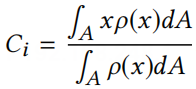
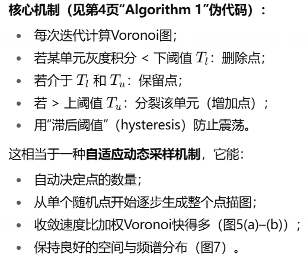

# 加权LBG点刻

## 前置概念

Voronoi图：平面上有随机一组点，给每个点划分一个区域，使得区域内的每个位置到该点的距离比到其他任何点的距离都近

## 方法组成

结合了两个主要组件：基于Lloyd（劳埃德）算法的加权Voronoi（沃罗诺伊）点刻 + LBG算法的变体

### 基于Lloyd（劳埃德）算法的加权Voronoi（沃罗诺伊）点刻

在Lloyd算法基础上引入加权机制，结合Voronoi图进行点刻技术的方法

**Lloyd算法**

输入：一组点集

计算Voronoi图：根据点集构建Voronoi图，将空间划分为若干个Voronoi单元

更新点位置：对每个Voronoi单元，将点移动到其单元的重心（单元内所有点位置的平均值）

重复2、3步，直到收敛（每个点的位置趋于稳定，不会改变）

**加权Voronoi点刻**

传统的Lloyd算法假设所有区域密度一致，而加权Voronoi点刻在Lloyd算法中加入了密度权重ρ(x)，从而实现点的自适应分布。

在Lloyd算法的基础上第三步更新点位置改进了：

使用公式计算重心Ci，当ρ(x)是密度函数（例如图像灰度），在暗区（灰度值大)会吸引更多的点，从而产生更密集的点刻分布。

这样一来，在图像暗部高密度区域，权重大，产生的点多、间距小；而在亮部低密度区域，权重小，产生的点少、间距大

> 需要良好的初始分布，否则收敛很慢；
>
> 难以控制点数；
>
> 最终容易形成规则六边形结构，影响视觉效果

### LBG算法变体

**LBG算法**

LBG用于向量量化，目标是给定一组训练向量，找到更少的代表向量，使得这些代表向量能最少化量化误差。

LBG算法的二维版本基于一组训练点创建一个预定数量的点集

过程：

从训练点集的质心作为初始点开始，

对当前点集计算Voronoi图，

将点集中每个点移动到其Voronoi单元中所有的训练样本的质心，

略微偏移分裂每个点成两个点，进行更细的划分

重复2、3、4直到达到设定的目标点数

**LBG算法变体**

引入加权Voronoi机制：不再处理抽象的训练点集，而是处理带有密度权重的连续域，每个Voronoi单元的密度由灰度值积分得到

引入合并操作：原始LBG算法只能分裂Voronoi单元，LBG变体引入了动态分裂与合并机制（若某个Voronoi单元灰度总量过低，则合并单元即删除该点；若灰度总量过高，则分裂单元即添加新点；否则保留该点，仅移动调整其位置）

### 两者是如何结合的

加权LBG点刻在加权Voronoi点刻基础上，引入LBG向量量化思想。不只是移动点，而是动态拆分、合并Voronoi单元

